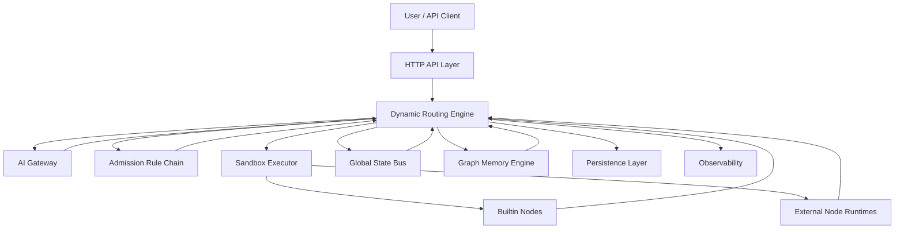

# DynAgent

> Dynamic, topology-free, production-grade Agent runtime for Go.

[English](./docs/README.en.md) | [简体中文](./docs/README.zh-CN.md) | [Architecture EN](./docs/architecture.en.md) | [架构说明 CN](./docs/architecture.zh-CN.md) | [Design EN](./docs/design.en.md) | [设计方案 CN](./docs/design.zh-CN.md)

## Why

Most "Agent frameworks" hardcode orchestration semantics somewhere:

- fixed DAGs
- implicit state mutation
- hidden execution graphs
- framework-owned control flow

`DynAgent` takes the opposite path:

- no predefined edges
- no baked-in business flow
- no node-side global state mutation
- no third-party agent orchestration framework

This repository is a Go-native execution kernel for dynamic Agents where the LLM chooses the next node and the runtime only enforces safety, validation, isolation, persistence, and observability.

## Design Axioms

- **Topology-free execution**: the runtime exposes a node pool, not a workflow graph.
- **LLM decides, runtime constrains**: AI picks `next_node`; the engine validates admission and system limits.
- **State is append/merge only**: nodes never mutate the master state directly.
- **Sandbox first**: each node runs behind timeout, panic recovery, and concurrency controls.
- **Trace everything**: every task, AI decision, node result, snapshot, and summary is replayable.

## Architecture Snapshot



## Execution Loop

```text
for task_not_terminated:
  1. load current State snapshot
  2. recall recommended nodes from memory
  3. ask AI for {next_node, reasoning, data}
  4. validate node existence + admission rules
  5. execute node in sandbox
  6. validate result patch
  7. merge patch into master State
  8. persist lineage + snapshot + trace
  9. check terminate / timeout / loop guard
```

## Repository Layout

```text
.
├── api/http                  # REST handlers
├── cmd/server                # main HTTP service
├── cmd/demo                  # minimal runnable demo
├── cmd/node-runner           # external node runtime process
├── configs                   # app config + dynamic node manifests
├── docs                      # multi-language docs and architecture docs
├── internal
│   ├── ai                    # unified AI gateway
│   ├── engine                # dynamic routing scheduler
│   ├── node                  # node contract + registry + manifest loader
│   ├── sandbox               # isolation, timeout, panic recovery
│   ├── state                 # state bus, snapshots, safe merge
│   ├── rules                 # CEL-based admission chain
│   ├── memory                # graph memory and node recommendation
│   ├── persistence           # memory / postgres / redis-backed storage
│   ├── summary               # structured task summary
│   └── observe               # metrics, logs, tracing
├── migrations/postgres       # relational schema
├── pkg/contracts             # runtime contracts for external nodes
├── plugins/builtin           # built-in generic nodes
└── proto                     # runtime protocol definition
```

## Features

- Unified AI gateway with normalized decision payloads
- Builtin node system and external hot-loadable node runtimes
- CEL-based declarative admission rules
- Immutable node input via deep-copied read-only state
- Incremental snapshots and replayable execution lineage
- Short/mid/long memory model with node recommendation
- Structured summary generation and resume support
- Prometheus metrics + OTEL trace plumbing

## Quick Start

```bash
cp ./configs/config.yaml.example ./configs/config.yaml
docker compose up -d postgres redis
go run ./cmd/server --config ./configs/config.yaml
```

Create a task:

```bash
curl -X POST http://localhost:8080/v1/tasks \
  -H 'Content-Type: application/json' \
  -d '{
    "text": "Summarize this framework execution path.",
    "keywords": ["summarize", "framework", "execution"],
    "labels": {"source": "readme"}
  }'
```

## Open Source Docs

- [English README](./docs/README.en.md)
- [中文 README](./docs/README.zh-CN.md)
- [English Architecture Guide](./docs/architecture.en.md)
- [中文架构说明](./docs/architecture.zh-CN.md)
- [English Design Spec](./docs/design.en.md)
- [中文设计方案](./docs/design.zh-CN.md)
- [Contributing Guide](./CONTRIBUTING.md)
- [License](./LICENSE)

## Status

The repository is scaffolded as a production-oriented open source project.  
The project has been verified with `go mod tidy`, `CGO_ENABLED=0 go test ./...`, and `CGO_ENABLED=0 go run ./cmd/demo --config ./configs/config.yaml`.
