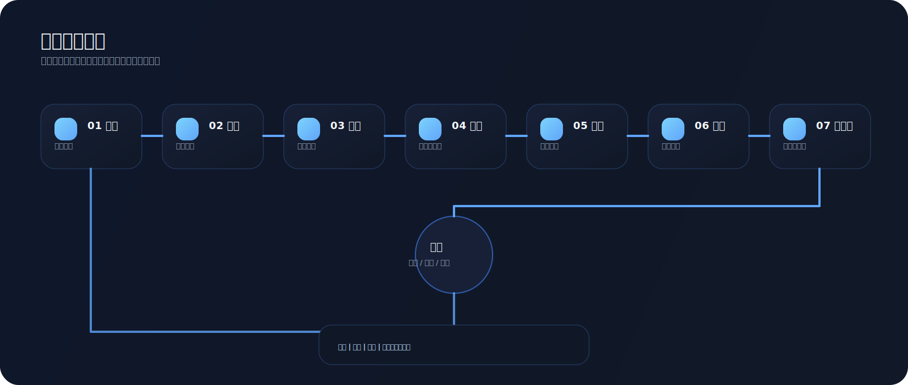
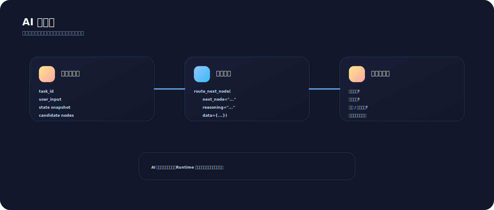

# DynAgent 🧠⚙️

> 一个 Go 原生、无预设拓扑、生产级可落地的动态 Agent 运行时内核。

[English](#english) | [接入指南](./docs/integration.zh-CN.md) | [架构说明](./docs/architecture.zh-CN.md) | [设计方案](./docs/design.zh-CN.md) | [Architecture EN](./docs/architecture.en.md) | [Design EN](./docs/design.en.md)

## 🧩 核心命题

很多所谓的 Agent 框架，本质上把编排策略偷偷写死在框架内部：

- 固定 DAG 边
- 隐式状态修改
- 隐藏控制流
- 框架内耦合业务执行语义

`DynAgent` 不这么做。

DynAgent 把 Agent 执行建模成一个“受约束的运行时问题”：

```text
NodePool + StateBus + AdmissionRules + AIRouter + Sandbox + Memory = Runtime Graph
```

没有预定义边。  
没有节点侧全局状态所有权。  
没有第三方 Agent 编排框架依赖。

## 🚀 运行时公理

- **Topology-free**：运行时暴露的是节点集合，而不是固定流程图。
- **LLM-routed**：模型选择 `next_node`，引擎负责校验与约束。
- **Scheduler-owned state**：节点只能产出 patch，只有调度器能合并。
- **Isolation-first**：节点执行天然运行在 timeout / recover / concurrency guard 后面。
- **Replayability-first**：决策、快照、血缘、摘要全部可追溯。

## 🧠 路由协议

DynAgent 的智能路由是 **Function Calling-only**，不接受自由文本决策，也不兼容历史 JSON 猜测链路：

```text
route_next_node(
  next_node: string,
  reasoning: string,
  data: object
)
```

- `next_node`：目标节点标识，或 `__terminate__`
- `reasoning`：简短、可追溯的路由理由
- `data`：结构化上下文，例如候选节点命中原因、路由参数

如果业务需要“先规划、后执行”，可以显式启用第二个函数：

```text
propose_dag(
  goal: string,
  nodes: string[],
  edges: {from,to}[],
  reasoning: string,
  data: object
)
```

`propose_dag(...)` 只负责产出规划痕迹；真正执行仍然坚持**单步决策、单步校验、单步执行**。

## 🗺️ 架构图


## 🔁 控制环



## 🧬 数据流转



## 🗺️ 时序视图


## 🆚 设计差异

| 维度 | DynAgent | Claude Code | LangGraph |
| --- | --- | --- | --- |
| 核心范式 | 受约束的动态 Agent Runtime | 面向编码任务的 Agentic IDE / CLI 助手 | 显式图编排框架 |
| 控制权分布 | LLM 选节点，Runtime 做准入、合并、持久化 | 模型主导工具使用，围绕代码工作流协作 | 开发者预定义图结构与状态流 |
| 拓扑假设 | 无预设边，运行时生成执行轨迹 | 通常围绕任务上下文动态决策，不强调通用节点图 | 天然依赖节点边与图结构定义 |
| 状态所有权 | 调度器独占主 State，节点只回 Patch | 以会话 / 工作区上下文为中心 | 图状态通常由框架图执行器传递 |
| 第一目标 | 通用、可审计、可回放的执行内核 | 提升编码生产力 | 构建可控的图式 Agent 工作流 |
| 设计立场 | Runtime over Workflow DSL | Coding Agent over Runtime Kernel | Graph over Runtime Freedom |


## 🧱 仓库结构

```text
.
├── api/http                  # REST 接口入口
├── cmd/server                # 主运行时服务
├── cmd/demo                  # 最小可运行 demo
├── cmd/node-runner           # 外部节点运行时进程
├── configs                   # 主配置 + 动态节点 manifest
├── docs                      # 中英文文档、架构、设计、SVG 图
├── internal
│   ├── ai                    # AI 网关：适配、重试、限流、熔断、降级
│   ├── engine                # 动态调度核心
│   ├── node                  # 节点接口、注册中心、热加载
│   ├── sandbox               # 沙箱隔离、超时、panic recover、并发池
│   ├── state                 # 状态总线、快照、安全合并
│   ├── rules                 # CEL 准入规则链
│   ├── memory                # 图记忆与候选节点召回
│   ├── persistence           # memory/postgres/redis 存储实现
│   ├── summary               # 结构化链路摘要
│   └── observe               # 日志、指标、Trace
├── migrations/postgres       # 关系型 schema
├── pkg/contracts             # 外部节点运行时契约
├── plugins/builtin           # 内置通用节点
└── proto                     # Runtime 协议定义
```

## ✨ 关键性质

- 固定路由函数契约：`route_next_node(next_node, reasoning, data)`
- 内置节点 + 外部节点双平面
- 基于 CEL 的声明式准入校验
- 节点只拿只读状态副本
- 增量快照与可回放执行血缘
- 支持从最近快照断点续跑
- Prometheus + OpenTelemetry 可观测性接入
- 符合 Go 社区习惯的工程结构

## 🛠️ 它现在能干嘛

当前仓库已经能：

- 接收任务并跑完整动态链路
- 让 AI 通过 `route_next_node(...)` 选择下一跳节点
- 在启用规划模式时，通过 `propose_dag(...)` 记录 DAG 规划痕迹
- 在沙箱中执行节点并合并状态 patch
- 保存步骤、快照、血缘、结构化摘要
- 提供任务查询、摘要查询、回放、续跑接口
- 支持内置节点和外部节点两种接入方式

它当前最适合被当成：

- 动态 Agent runtime 内核
- 你的业务 Agent 底座
- 一个可审计、可回放、可二开的执行框架

## ⚡ 快速开始

```bash
cp ./configs/config.yaml.example ./configs/config.yaml
docker compose up -d postgres redis
CGO_ENABLED=0 go test ./...
CGO_ENABLED=0 go run ./cmd/server --config ./configs/config.yaml
```

运行框架内天气 demo：

```bash
CGO_ENABLED=0 go run ./cmd/demo --config ./configs/config.yaml \
  --prompt '帮我查一下我当前位置的天气，并告诉我要不要带伞'
```

接入真实 LLM API 后，推荐这样跑：

```bash
export LLM_API_KEY="your-api-key"

CGO_ENABLED=0 go run ./cmd/demo --config ./configs/config.yaml \
  --prompt '帮我查一下我当前位置的天气，并告诉我要不要带伞' \
  --verbose
```

这个 demo 现在默认会完整穿过这条链路：

1. 注册 3 个自定义天气节点
2. 把候选节点和只读状态组装成 `routing_context`
3. 通过 function calling 注册 `route_next_node(...)` / `propose_dag(...)`
4. 让 LLM 只返回函数调用，不直接执行业务逻辑
5. Runtime 校验准入规则并在沙箱内执行节点
6. 合并 patch、生成轨迹、输出结构化摘要

如果你已经接入了真实模型，默认输出会直接展示：

- `provider_info`
- `registered_nodes`
- `function_contracts`
- `llm_registration`
- `decision_trace`
- `node_outputs`
- `final_summary`

加上 `--verbose` 会额外输出：

- `routing_context`
- `openai_tools`
- `anthropic_tools`
- `runtime_state`

提交任务：

```bash
curl -X POST http://localhost:8080/v1/tasks \
  -H 'Content-Type: application/json' \
  -d '{
    "text": "Summarize this framework execution path.",
    "keywords": ["summarize", "framework", "execution"],
    "labels": {"source": "readme"}
  }'
```

## 📚 文档入口

- [中文接入指南](./docs/integration.zh-CN.md)
- [中文架构说明](./docs/architecture.zh-CN.md)
- [中文设计方案](./docs/design.zh-CN.md)
- [English README](./docs/README.en.md)
- [English Architecture Guide](./docs/architecture.en.md)
- [English Design Spec](./docs/design.en.md)
- [Contributing Guide](./CONTRIBUTING.md)
- [License](./LICENSE)

## ✅ 当前验证

已完成：

```bash
go mod tidy
CGO_ENABLED=0 go test ./...
CGO_ENABLED=0 go run ./cmd/demo --config ./configs/config.yaml --prompt '帮我查一下我当前位置的天气，并告诉我要不要带伞'
```

## 🛰️ GitHub

仓库：`Yonsun-w/dynagent-go`

---

## English

> A Go-native, topology-free, production-grade runtime kernel for dynamic Agents.

[中文](#dynagent-️) | [Architecture EN](./docs/architecture.en.md) | [Design EN](./docs/design.en.md)

### 🧩 Thesis

Many so-called Agent frameworks secretly hardcode orchestration semantics:

- fixed DAG edges
- implicit state mutation
- hidden control flow
- framework-coupled execution logic

`DynAgent` does not.

DynAgent models Agent execution as a constrained runtime problem:

```text
NodePool + StateBus + AdmissionRules + AIRouter + Sandbox + Memory = Runtime Graph
```

No predefined edges.  
No node-owned global state mutation.  
No third-party orchestration framework dependency.

### 🚀 Runtime Axioms

- **Topology-free**: the runtime exposes a node set, not a fixed workflow.
- **LLM-routed**: the model selects `next_node`; the engine validates and constrains.
- **Scheduler-owned state**: nodes emit patches; only the engine merges them.
- **Isolation-first**: node execution is always wrapped by timeout, recover, and concurrency guards.
- **Replayability-first**: decisions, snapshots, lineage, and summaries are persisted.

### 🧠 Routing Contract

DynAgent is **Function Calling-only** for routing. It does not accept free-form text decisions and does not keep legacy JSON guessing paths:

```text
route_next_node(
  next_node: string,
  reasoning: string,
  data: object
)
```

- `next_node`: target node id or `__terminate__`
- `reasoning`: short audit-friendly explanation
- `data`: structured routing metadata

If a product needs planning-first behavior, it can enable a second function such as:

```text
propose_dag(
  goal: string,
  nodes: string[],
  edges: {from,to}[],
  reasoning: string,
  data: object
)
```

`propose_dag(...)` records a plan only. The runtime still executes one validated hop at a time.

### 🗺️ Architecture


### 🔁 Control Loop


### 🧬 Data Flow


### 🗺️ Sequence View


### 🆚 Design Delta

| Dimension | DynAgent | Claude Code | LangGraph |
| --- | --- | --- | --- |
| Core model | constrained dynamic Agent runtime | agentic IDE / CLI for coding tasks | explicit graph orchestration framework |
| Control ownership | LLM selects nodes, runtime owns admission and state merge | model-centric tool use around coding workflows | developer-defined graph drives transitions |
| Topology assumption | no predefined edges | dynamic task flow, not a general runtime graph kernel | graph structure is a first-class primitive |
| State ownership | scheduler owns master state; nodes emit patches | session / workspace oriented context | state is usually propagated by the graph executor |
| Primary target | auditable and replayable execution kernel | coding productivity | controllable graph-based Agent workflows |
| Design stance | Runtime over Workflow DSL | Coding Agent over Runtime Kernel | Graph over Runtime Freedom |

### 🧱 Repository Layout

```text
.
├── api/http                  # REST entrypoints
├── cmd/server                # runtime service
├── cmd/demo                  # minimal runnable demo
├── cmd/node-runner           # external node runtime process
├── configs                   # app config + node manifests
├── docs                      # EN/CN docs, architecture, design, SVG diagrams
├── internal
│   ├── ai                    # AI gateway
│   ├── engine                # dynamic scheduler
│   ├── node                  # node contract + registry + hot-load
│   ├── sandbox               # isolation + timeout + recover + pool
│   ├── state                 # state bus + snapshots + safe merge
│   ├── rules                 # CEL admission chain
│   ├── memory                # graph memory + node recommendation
│   ├── persistence           # memory/postgres/redis backends
│   ├── summary               # structured task summary
│   └── observe               # logs + metrics + tracing
├── migrations/postgres
├── pkg/contracts
├── plugins/builtin
└── proto
```

### ✨ Properties

- Fixed routing function contract: `route_next_node(next_node, reasoning, data)`
- Builtin and external node planes
- Declarative admission checks via CEL
- Readonly state snapshots for every node
- Incremental snapshots and replayable lineage
- Resume from latest durable snapshot
- Prometheus + OpenTelemetry ready
- Production-oriented Go project layout

### 🛠️ What It Can Do Now

The current repository can already:

- accept a task and execute a full dynamic chain
- let AI select the next node through `route_next_node(...)`
- record DAG planning traces through `propose_dag(...)` when planning mode is enabled
- execute nodes in a sandbox and merge state patches
- persist steps, snapshots, lineage, and summaries
- provide query, replay, and resume APIs
- support both builtin nodes and external node runtimes

It is best used today as:

- a dynamic Agent runtime kernel
- a foundation for your own business Agents
- an auditable, replayable, extensible execution framework

### ⚡ Quick Start

```bash
cp ./configs/config.yaml.example ./configs/config.yaml
docker compose up -d postgres redis
CGO_ENABLED=0 go test ./...
CGO_ENABLED=0 go run ./cmd/server --config ./configs/config.yaml
```

Run the framework-native weather demo:

```bash
CGO_ENABLED=0 go run ./cmd/demo --config ./configs/config.yaml \
  --prompt '帮我查一下我当前位置的天气，并告诉我要不要带伞'
```

Submit a task:

```bash
curl -X POST http://localhost:8080/v1/tasks \
  -H 'Content-Type: application/json' \
  -d '{
    "text": "Summarize this framework execution path.",
    "keywords": ["summarize", "framework", "execution"],
    "labels": {"source": "readme"}
  }'
```

### 📚 Docs

- [Integration Guide CN](./docs/integration.zh-CN.md)
- [Architecture EN](./docs/architecture.en.md)
- [Design EN](./docs/design.en.md)
- [Contributing Guide](./CONTRIBUTING.md)
- [License](./LICENSE)
