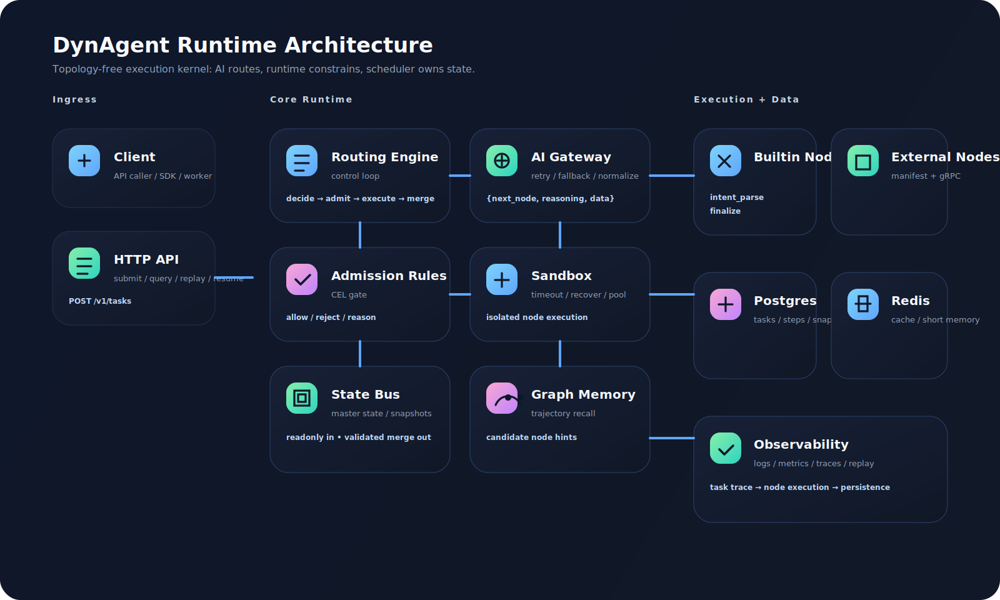
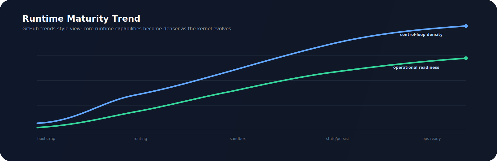
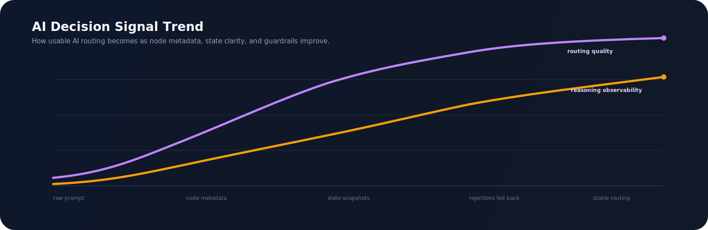

# DynAgent 🧠⚙️

> 一个 Go 原生、无预设拓扑、生产级可落地的动态 Agent 运行时内核。

[English](./docs/README.en.md) | [接入指南](./docs/integration.zh-CN.md) | [架构说明](./docs/architecture.zh-CN.md) | [设计方案](./docs/design.zh-CN.md) | [Architecture EN](./docs/architecture.en.md) | [Design EN](./docs/design.en.md)

## 🧩 核心命题

很多所谓的 Agent 框架，本质上把编排策略偷偷写死在框架内部：

- 固定 DAG 边
- 隐式状态修改
- 隐藏控制流
- 框架内耦合业务执行语义

`DynAgent` 不这么做。

DynAgent 把 Agent 执行建模成一个“受约束的运行时问题”：

```text
NodePool + StateBus + AdmissionRules + AIRouter + Sandbox + Memory = Runtime Graph
```

没有预定义边。  
没有节点侧全局状态所有权。  
没有第三方 Agent 编排框架依赖。

## 🚀 运行时公理

- **Topology-free**：运行时暴露的是节点集合，而不是固定流程图。
- **LLM-routed**：模型选择 `next_node`，引擎负责校验与约束。
- **Scheduler-owned state**：节点只能产出 patch，只有调度器能合并。
- **Isolation-first**：节点执行天然运行在 timeout / recover / concurrency guard 后面。
- **Replayability-first**：决策、快照、血缘、摘要全部可追溯。

## 🗺️ 架构图



## 🔁 控制环


## 🧬 数据流转


## 📈 趋势图





## 🧱 仓库结构

```text
.
├── api/http                  # REST 接口入口
├── cmd/server                # 主运行时服务
├── cmd/demo                  # 最小可运行 demo
├── cmd/node-runner           # 外部节点运行时进程
├── configs                   # 主配置 + 动态节点 manifest
├── docs                      # 中英文文档、架构、设计、SVG 图
├── internal
│   ├── ai                    # AI 网关：适配、重试、限流、熔断、降级
│   ├── engine                # 动态调度核心
│   ├── node                  # 节点接口、注册中心、热加载
│   ├── sandbox               # 沙箱隔离、超时、panic recover、并发池
│   ├── state                 # 状态总线、快照、安全合并
│   ├── rules                 # CEL 准入规则链
│   ├── memory                # 图记忆与候选节点召回
│   ├── persistence           # memory/postgres/redis 存储实现
│   ├── summary               # 结构化链路摘要
│   └── observe               # 日志、指标、Trace
├── migrations/postgres       # 关系型 schema
├── pkg/contracts             # 外部节点运行时契约
├── plugins/builtin           # 内置通用节点
└── proto                     # Runtime 协议定义
```

## ✨ 关键性质

- 统一 AI 决策契约：`{next_node, reasoning, data}`
- 内置节点 + 外部节点双平面
- 基于 CEL 的声明式准入校验
- 节点只拿只读状态副本
- 增量快照与可回放执行血缘
- 支持从最近快照断点续跑
- Prometheus + OpenTelemetry 可观测性接入
- 符合 Go 社区习惯的工程结构

## 🛠️ 它现在能干嘛

当前仓库已经能：

- 接收任务并跑完整动态链路
- 让 AI 选择下一跳节点
- 在沙箱中执行节点并合并状态 patch
- 保存步骤、快照、血缘、结构化摘要
- 提供任务查询、摘要查询、回放、续跑接口
- 支持内置节点和外部节点两种接入方式

它当前最适合被当成：

- 动态 Agent runtime 内核
- 你的业务 Agent 底座
- 一个可审计、可回放、可二开的执行框架

## ⚡ 快速开始

```bash
cp ./configs/config.yaml.example ./configs/config.yaml
docker compose up -d postgres redis
CGO_ENABLED=0 go test ./...
CGO_ENABLED=0 go run ./cmd/server --config ./configs/config.yaml
```

提交任务：

```bash
curl -X POST http://localhost:8080/v1/tasks \
  -H 'Content-Type: application/json' \
  -d '{
    "text": "Summarize this framework execution path.",
    "keywords": ["summarize", "framework", "execution"],
    "labels": {"source": "readme"}
  }'
```

## 📚 文档入口

- [中文接入指南](./docs/integration.zh-CN.md)
- [中文架构说明](./docs/architecture.zh-CN.md)
- [中文设计方案](./docs/design.zh-CN.md)
- [English README](./docs/README.en.md)
- [English Architecture Guide](./docs/architecture.en.md)
- [English Design Spec](./docs/design.en.md)
- [Contributing Guide](./CONTRIBUTING.md)
- [License](./LICENSE)

## ✅ 当前验证

已完成：

```bash
go mod tidy
CGO_ENABLED=0 go test ./...
CGO_ENABLED=0 go run ./cmd/demo --config ./configs/config.yaml
```

## 🛰️ GitHub

仓库：`Yonsun-w/dynagent-go`
