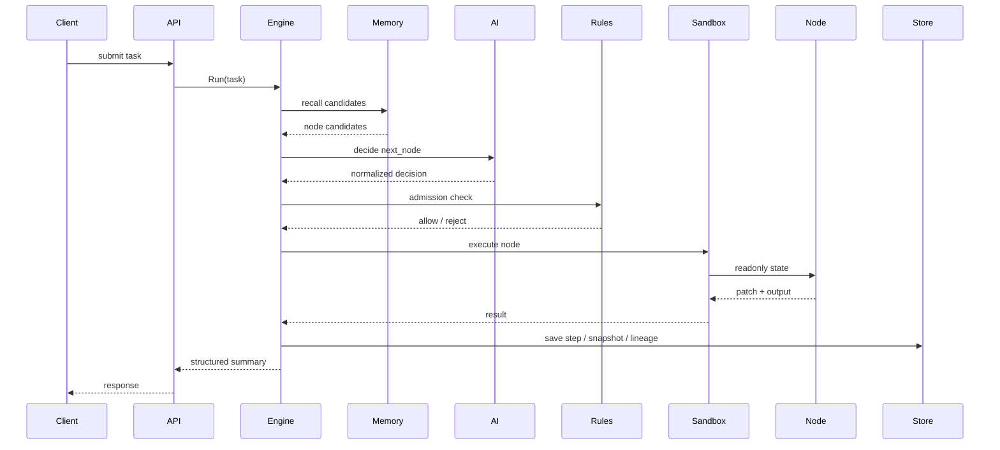

# DynAgent 🧠

Go-native dynamic Agent runtime. Not a workflow editor. Not a prompt wrapper. Not a DAG toy.

## 🎯 Target Shape

DynAgent is built for systems that need:

- model-selected next hops
- zero predefined node edges
- strict state ownership
- resumable task execution
- replayable lineage
- production-grade runtime controls

## 🧪 Mental Model

DynAgent executes an Agent task as a constrained state machine with AI-routed transitions:

```text
CurrentState + CandidateNodes + AdmissionPolicy + AIRouter -> NextStep
```

The runtime graph is materialized during execution, not precompiled in config.

## 🔒 Invariants

- no LangChain / LangGraph / AutoGPT / Dify / Flowise class dependencies
- no direct node mutation of master state
- no hardcoded node-to-node edge graph
- no uncontrolled node execution outside sandbox
- no task execution without step/time/loop guards

## 🧠 Core Subsystems

### AI Gateway 🤖

Normalizes all model outputs into:

```json
{
  "next_node": "string",
  "reasoning": "string",
  "data": {}
}
```

Built-in concerns:

- retry
- rate limiting
- circuit breaker
- fallback routing

### Node Plane 🔌

Two execution forms:

- builtin nodes
- external runtime nodes via manifest + gRPC

### Sandbox 🧪

Per-node controls:

- goroutine isolation
- timeout
- panic recovery
- concurrency pool

### State Bus 🧬

Carries task-scoped runtime data:

- metadata
- user input
- working memory
- node outputs
- decision log
- trace metadata
- sensitive values

### Dynamic Routing Engine ⚙️

Main loop:

```text
decide -> validate -> admit -> sandbox execute -> validate patch -> merge -> persist -> repeat
```

### Memory Engine 🧠

Stores:

- short-term trajectory
- frequent execution patterns
- historical task patterns

### Observability 📡

- structured logs
- Prometheus metrics
- OTEL trace hooks

## 🗺️ Sequence View



## ⚡ Commands

```bash
CGO_ENABLED=0 go test ./...
CGO_ENABLED=0 go run ./cmd/demo --config ./configs/config.yaml
CGO_ENABLED=0 go run ./cmd/server --config ./configs/config.yaml
```

## 🧷 Builtin Demo Nodes

- `intent_parse`
- `text_transform`
- `generic_http_call`
- `finalize`
- `external_echo`

## 📎 Notes

- default storage backend is `memory`
- Postgres + Redis backends are scaffolded
- docs are split into README / architecture / design
