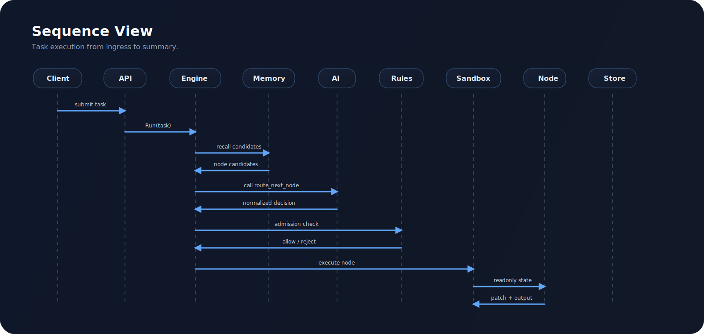

# DynAgent 🧠

Go-native dynamic Agent runtime. Not a workflow editor. Not a prompt wrapper. Not a DAG toy.

## 🎯 Target Shape

DynAgent is built for systems that need:

- model-selected next hops
- zero predefined node edges
- strict state ownership
- resumable task execution
- replayable lineage
- production-grade runtime controls

## 🧪 Mental Model

DynAgent executes an Agent task as a constrained state machine with AI-routed transitions:

```text
CurrentState + CandidateNodes + AdmissionPolicy + AIRouter -> NextStep
```

The runtime graph is materialized during execution, not precompiled in config.

## 🔒 Invariants

- no LangChain / LangGraph / AutoGPT / Dify / Flowise class dependencies
- no direct node mutation of master state
- no hardcoded node-to-node edge graph
- no uncontrolled node execution outside sandbox
- no task execution without step/time/loop guards

## 🧠 Core Subsystems

### AI Gateway 🤖

DynAgent uses a Function Calling-only decision contract:

```text
route_next_node(
  next_node: string,
  reasoning: string,
  data: object
)
```

Built-in concerns:

- retry
- rate limiting
- circuit breaker
- fallback routing

### Node Plane 🔌

Two execution forms:

- builtin nodes
- external runtime nodes via manifest + gRPC

### Sandbox 🧪

Per-node controls:

- goroutine isolation
- timeout
- panic recovery
- concurrency pool

### State Bus 🧬

Carries task-scoped runtime data:

- metadata
- user input
- working memory
- node outputs
- decision log
- trace metadata
- sensitive values

### Dynamic Routing Engine ⚙️

Main loop:

```text
decide -> validate -> admit -> sandbox execute -> validate patch -> merge -> persist -> repeat
```

If a product needs planning-first execution, it can additionally enable:

```text
propose_dag(
  goal: string,
  nodes: string[],
  edges: {from,to}[],
  reasoning: string,
  data: object
)
```

The plan is recorded in state/summary/memory only. Actual execution remains hop-based.

## 🆚 Design Delta

| Dimension | DynAgent | Claude Code | LangGraph |
| --- | --- | --- | --- |
| Core model | constrained dynamic Agent runtime | agentic IDE / CLI for coding tasks | explicit graph orchestration framework |
| Topology assumption | no predefined edges | dynamic task flow, not a general runtime graph kernel | graph structure is first-class |
| State ownership | scheduler owns master state | session / workspace oriented context | graph executor propagates state |
| Target problem | general execution kernel | coding productivity | graph-based Agent workflows |

### Memory Engine 🧠

Stores:

- short-term trajectory
- frequent execution patterns
- historical task patterns

### Observability 📡

- structured logs
- Prometheus metrics
- OTEL trace hooks

## 🗺️ Sequence View



## ⚡ Commands

```bash
CGO_ENABLED=0 go test ./...
CGO_ENABLED=0 go run ./cmd/demo --config ./configs/config.yaml \
  --prompt 'Check the weather for my current location and tell me whether I should bring an umbrella'
CGO_ENABLED=0 go run ./cmd/server --config ./configs/config.yaml
```

Once a real LLM API is configured, run the same demo with `--verbose` to inspect function contracts, tool registration payloads, and routing decisions.

## 🧷 Framework Demo

The default demo is now a **framework-native weather agent**:

- `resolve_user_location`
- `query_weather`
- `finalize_weather_answer`
- `route_next_node(...)`
- `propose_dag(...)`
- custom node registration + AI routing + sandbox execution + patch merge + structured summary

## 📎 Notes

- default storage backend is `memory`
- Postgres + Redis backends are scaffolded
- docs are split into README / architecture / design
