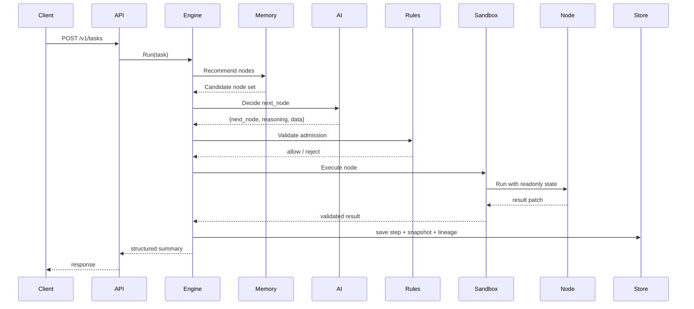

# DynAgent

Dynamic, topology-free, production-grade Agent runtime written in Go.

## What It Is

DynAgent is not a workflow builder. It is an execution kernel.

It is designed for teams that want:

- model-driven next-hop selection
- zero hardcoded node edges
- strict runtime admission control
- sandboxed node execution
- resumable task state
- replayable execution lineage
- production-grade observability

## Core Idea

Instead of defining a fixed graph like:

```text
A -> B -> C -> D
```

DynAgent works like this:

```text
NodePool + State + Constraints + AI Router = Runtime Graph at Execution Time
```

The graph is created while the task is running, not before it starts.

## Hard Guarantees

- The framework does not use LangChain, LangGraph, AutoGPT, Dify, Flowise, or similar orchestration frameworks.
- Nodes do not directly mutate the global state.
- The scheduler validates every AI-selected next hop.
- Every node runs with timeout and panic recovery.
- Task execution is bounded by max steps, total timeout, and loop detection.

## Main Components

### 1. AI Gateway

Normalizes model outputs into:

```json
{
  "next_node": "string",
  "reasoning": "string",
  "data": {}
}
```

It also provides:

- retries
- rate limiting
- circuit breaking
- fallback model routing

### 2. Node Registry

Supports:

- builtin nodes registered in Go
- external nodes loaded via manifest + gRPC runtime

### 3. Sandbox Executor

Provides:

- goroutine isolation
- timeout enforcement
- panic recovery
- concurrency pool limits

### 4. State Bus

Carries all task-scoped runtime data:

- task metadata
- user input
- working memory
- node outputs
- AI decision log
- trace metadata
- sensitive values

### 5. Dynamic Routing Engine

The main loop is:

```text
AI decide -> admission check -> sandbox execute -> validate patch -> merge state -> persist -> next round
```

### 6. Admission Rule Chain

Rules are declarative and CEL-based.  
They are evaluated against the current State projection only.

### 7. Graph Memory Engine

Stores:

- short-term trajectory
- mid-term frequent execution patterns
- long-term historical patterns

It recommends node candidates to the LLM without imposing execution order.

### 8. Persistence and Summary

Stores:

- tasks
- execution steps
- snapshots
- summaries
- lineage
- memory patterns

### 9. Observability

Includes:

- structured logs
- Prometheus metrics
- OpenTelemetry tracing hooks

## Runtime Topology



## Quick Start

```bash
cp ./configs/config.yaml.example ./configs/config.yaml
go run ./cmd/demo --config ./configs/config.yaml
go run ./cmd/server --config ./configs/config.yaml
```

## Minimal Demo Nodes

- `intent_parse`
- `text_transform`
- `generic_http_call`
- `finalize`
- `external_echo` as an external node runtime example

## Repository Notes

- Default config uses `memory` storage so the project can run locally with minimal setup.
- Postgres and Redis implementations are already scaffolded for production backend switching.
- The repository now includes dedicated architecture and design specs in `docs/`.
- Verified locally with `CGO_ENABLED=0 go test ./...` and `CGO_ENABLED=0 go run ./cmd/demo --config ./configs/config.yaml`.
