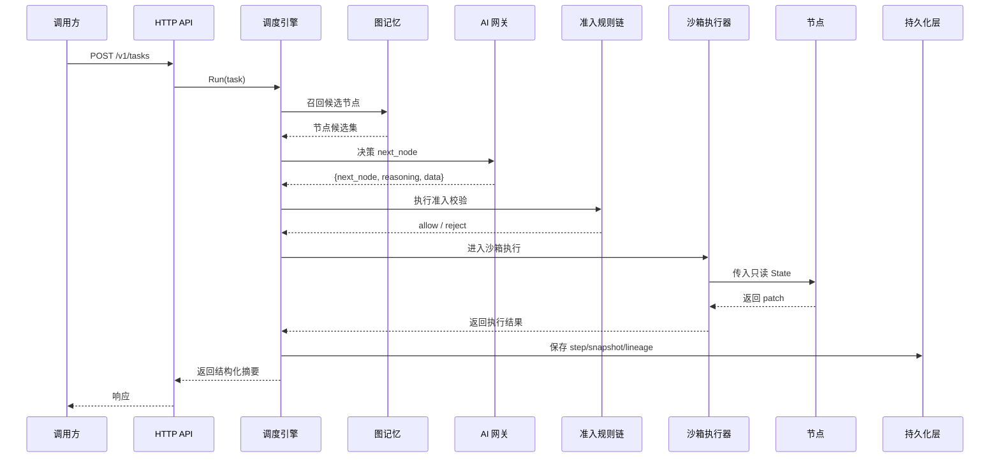

# DynAgent

一个用 Go 编写的、无预设拓扑、生产级可落地的动态 Agent 执行内核。

## 这不是“工作流搭建器”

DynAgent 的定位不是拖拽式 Flow，也不是固定 DAG 编排器，而是一个运行时执行内核。

它适合下面这类场景：

- 下一跳由模型动态选择
- 节点之间没有预设边
- 运行时必须做强约束和准入校验
- 节点执行必须隔离
- 任务必须可回放、可续跑、可复盘
- 需要真正可上线的可观测性与持久化能力

## 核心公式

传统编排框架会先定义：

```text
A -> B -> C -> D
```

DynAgent 的思路是：

```text
NodePool + State + Constraints + AI Router = 运行时动态执行图
```

也就是说，图不是配置出来的，而是跑出来的。

## 关键保证

- 不使用 LangChain、LangGraph、AutoGPT、Dify、Flowise 等 Agent/工作流框架
- 节点不能直接修改全局状态
- 每一跳都要经过调度器合法性与准入校验
- 每个节点都有超时、并发限制、panic 兜底
- 单任务一定受最大步数、总超时、循环检测保护

## 核心模块

### 1. AI Gateway

统一模型输出，强制归一成：

```json
{
  "next_node": "string",
  "reasoning": "string",
  "data": {}
}
```

并提供：

- 重试
- 限流
- 熔断
- 主备模型切换

### 2. Node Registry

支持两类节点：

- Go 内置节点
- 通过 manifest + gRPC 接入的外部节点

### 3. Sandbox Executor

提供：

- goroutine 级隔离
- 超时控制
- panic recover
- 并发池限流

### 4. State Bus

承载整条任务链路中的所有运行态数据：

- 任务元信息
- 用户输入
- working memory
- 节点输出
- AI 决策日志
- trace 信息
- 敏感数据

### 5. Dynamic Routing Engine

固定主循环为：

```text
AI 决策 -> 准入检查 -> 沙箱执行 -> 结果校验 -> 合并 State -> 持久化 -> 下一轮
```

### 6. Admission Rule Chain

准入规则基于 CEL，声明式配置，且只基于当前 State 做判断。

### 7. Graph Memory Engine

存储三类记忆：

- 短期轨迹
- 中期高频模式
- 长期历史模式

它只向模型推荐“候选节点集合”，不替模型决定执行顺序。

### 8. Persistence And Summary

负责持久化：

- task
- step
- snapshot
- summary
- lineage
- memory pattern

### 9. Observability

包含：

- 结构化日志
- Prometheus 指标
- OpenTelemetry Trace 接口

## 运行时架构图



## 快速启动

```bash
cp ./configs/config.yaml.example ./configs/config.yaml
go run ./cmd/demo --config ./configs/config.yaml
go run ./cmd/server --config ./configs/config.yaml
```

## 最小 Demo 节点

- `intent_parse`
- `text_transform`
- `generic_http_call`
- `finalize`
- `external_echo`，用于演示外部节点运行时接入

## 仓库说明

- 默认配置使用 `memory` 存储，方便本地快速跑通。
- Postgres + Redis 的生产后端实现已经预留并接入工厂选择逻辑。
- 仓库已补充独立的架构说明和设计方案文档。
- 已通过 `CGO_ENABLED=0 go test ./...` 和 `CGO_ENABLED=0 go run ./cmd/demo --config ./configs/config.yaml` 验证。
