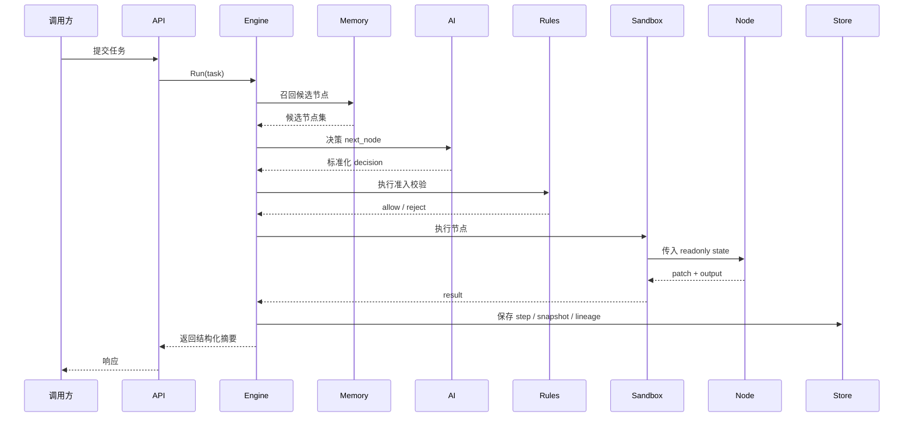

# DynAgent 🧠

一个 Go 原生的动态 Agent 执行运行时。不是工作流搭建器，不是提示词壳子，也不是固定 DAG 玩具。

## 🎯 目标形态

DynAgent 面向这种系统：

- 下一跳由模型选择
- 节点之间没有预设边
- 状态所有权必须严格
- 任务必须可续跑
- 链路必须可回放
- 运行时必须有生产级保护

## 🧪 思维模型

DynAgent 把 Agent 执行看成一个“由 AI 决定跳转、由 Runtime 施加约束”的状态机：

```text
CurrentState + CandidateNodes + AdmissionPolicy + AIRouter -> NextStep
```

执行图不是启动前写死的，而是在执行过程中实时长出来的。

## 🔒 不变量

- 不依赖 LangChain / LangGraph / AutoGPT / Dify / Flowise 这类框架
- 节点不能直接修改主 State
- 不存在硬编码节点边关系
- 节点不能绕开 sandbox 直接执行
- 任务没有最大步数 / 超时 / 循环保护就不允许运行

## 🧠 核心子系统

### AI Gateway 🤖

统一所有模型输出到：

```json
{
  "next_node": "string",
  "reasoning": "string",
  "data": {}
}
```

内建能力：

- 重试
- 限流
- 熔断
- 备用模型切换

### Node Plane 🔌

两种节点形态：

- 内置节点
- manifest + gRPC 外部节点运行时

### Sandbox 🧪

对每个节点施加：

- goroutine 隔离
- 超时
- panic recover
- 并发池限制

### State Bus 🧬

承载任务级运行态：

- metadata
- user input
- working memory
- node outputs
- decision log
- trace 信息
- sensitive values

### Dynamic Routing Engine ⚙️

主循环：

```text
decide -> validate -> admit -> sandbox execute -> validate patch -> merge -> persist -> repeat
```

### Memory Engine 🧠

存储：

- 短期轨迹
- 高频执行模式
- 历史任务模式

### Observability 📡

- 结构化日志
- Prometheus 指标
- OTEL Trace 接口

## 🗺️ 时序图



## ⚡ 常用命令

```bash
CGO_ENABLED=0 go test ./...
CGO_ENABLED=0 go run ./cmd/demo --config ./configs/config.yaml
CGO_ENABLED=0 go run ./cmd/server --config ./configs/config.yaml
```

## 🧷 Demo 内置节点

- `intent_parse`
- `text_transform`
- `generic_http_call`
- `finalize`
- `external_echo`

## 📎 说明

- 默认存储后端是 `memory`
- 已预留 Postgres + Redis 后端
- 文档拆分为 README / architecture / design 三层
