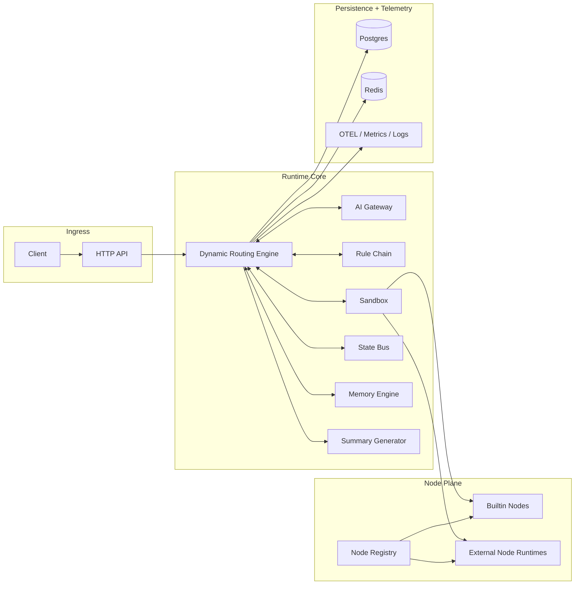

# DynAgent Architecture

## 1. Problem Statement

Most agent runtimes collapse orchestration, business flow, and state mutation into one layer. That becomes hard to evolve once you need:

- dynamic next-hop routing
- production-grade observability
- replayable execution
- runtime hot-loading of business capabilities
- strict isolation between node logic and scheduler state

DynAgent splits those concerns cleanly.

## 2. System View



## 3. Responsibility Boundaries

### HTTP API

- accepts tasks
- attaches trace metadata
- returns structured summaries
- exposes query/resume/replay endpoints

### Dynamic Routing Engine

- owns task lifecycle
- executes the main control loop
- validates AI-selected nodes
- merges node patches into the master state
- enforces max-steps / timeout / loop guards

### AI Gateway

- abstracts vendor differences
- normalizes model output
- applies retry, rate limiting, and circuit breaking
- supports primary/fallback model routing

### Node Registry

- tracks builtin nodes
- loads external node manifests
- attaches runtime clients for hot-loaded node processes

### Sandbox Executor

- isolates node execution
- enforces per-node timeout
- prevents panics from escaping to the engine
- applies concurrency limits

### State Bus

- stores the only writable task state
- exposes readonly deep copies to nodes
- records decisions and snapshots

### Rule Chain

- validates node entry conditions
- rejects illegal transitions with explicit reasons
- remains pure: state in, decision out

### Memory Engine

- records trajectories
- surfaces frequent node patterns
- recommends candidate nodes for similar tasks

### Persistence

- stores tasks, steps, snapshots, summaries, lineage
- keeps short-term runtime cache and memory hints

### Observability

- trace per task
- metrics per AI call / node execution / task outcome
- structured logs for debugging and operations

## 4. Data Model

The runtime state is task-scoped and versioned.

```text
State
├── TaskMeta
├── UserInput
├── WorkingMemory
├── NodeOutputs
├── DecisionLog
├── Trace
├── Sensitive
└── Ext
```

Mutation model:

- nodes receive `ReadOnlyState`
- nodes return `Patch`
- engine validates and merges `Patch`
- engine persists a new `Snapshot`

This avoids direct pointer mutation by node code.

## 5. Execution Semantics

Each loop iteration is deterministic at the runtime level:

1. take the current State
2. ask memory for candidate nodes
3. ask AI for next hop
4. validate node existence
5. validate admission rules
6. execute node inside sandbox
7. validate node result
8. merge patch into master State
9. persist lineage, snapshot, and summary context

The non-deterministic component is the AI decision. The runtime around it is strict.

## 6. Hot-Load Model

DynAgent does not rely on Go `plugin`.

Instead:

- each external node is a separate process
- the process exposes the runtime contract over gRPC
- the scheduler discovers nodes through manifest files
- manifests can be added, updated, or removed without restarting the main service

That gives better operational control and isolates node crashes from the scheduler.

## 7. Failure Domains

### Node Failure

- panic recovered by sandbox
- timeout terminates the node invocation
- engine keeps control

### AI Failure

- retry
- rate limit backpressure
- circuit breaker
- fallback model

### Task Failure

- timeout guard
- max-step guard
- loop detection guard
- resumable from latest snapshot

## 8. Observability Model

Every task should be reconstructable from:

- decision log
- execution steps
- state snapshots
- lineage
- structured summary
- trace metadata

This is why DynAgent is designed as an execution system, not just a prompt wrapper.
