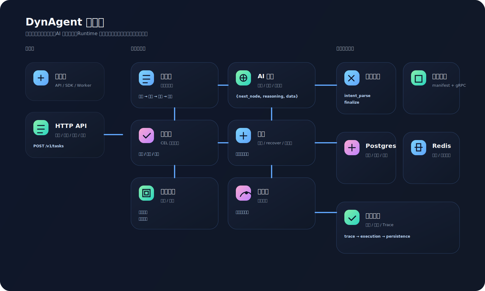
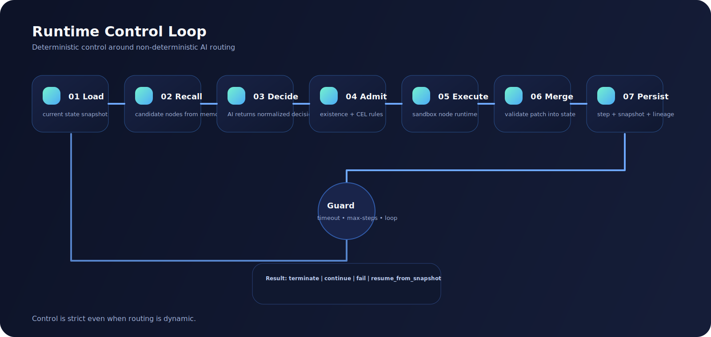
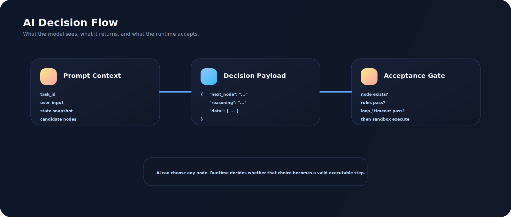

# DynAgent 架构说明 🛰️

## 1. 问题框架

很多 Agent 运行时把“编排逻辑、业务流转、状态修改、可观测性”全部混在一起，一旦要支持下面这些能力，就会迅速失控：

- 动态下一跳路由
- 生产级可观测性
- 全链路回放
- 运行时热加载业务节点
- 节点逻辑和调度状态强隔离

DynAgent 的目标，就是把这些职责拆成明确的运行时平面。

## 2. 总体架构 🗺️



## 3. 模块职责边界 🔬

### HTTP API 🌐

- 接收任务
- 注入 Trace 上下文
- 输出结构化摘要
- 提供查询、续跑、回放接口

### 动态路由引擎 ⚙️

- 拥有任务生命周期
- 执行主调度循环
- 校验 AI 选择的下一跳是否合法
- 统一合并节点结果到主 State
- 施加最大步数、总超时、循环检测保护

### AI 网关 🤖

- 屏蔽不同模型厂商差异
- 统一输出格式
- 承担重试、限流、熔断、主备切换

### 节点注册中心 🔌

- 管理内置节点
- 监听并加载外部节点 manifest
- 为热加载节点维护运行时客户端

### 沙箱执行器 🧪

- 隔离节点执行
- 控制单节点超时
- 拦截 panic
- 限制并发

### State 总线 🧬

- 保存唯一可写的任务状态
- 给节点只暴露深拷贝只读视图
- 记录决策日志和快照

### 准入规则链 🛂

- 判断节点是否允许进入执行
- 拒绝时给出明确原因
- 保持纯函数风格：输入 State，输出决策结果

### 图记忆引擎 🧠

- 记录执行轨迹
- 聚合高频节点模式
- 为相似任务推荐候选节点

### 持久化层 💾

- 保存任务、步骤、快照、摘要、血缘
- 为短期记忆和缓存提供运行态支持

### 可观测性 📡

- 任务级 Trace
- AI 调用、节点执行、任务完成率指标
- 结构化日志

## 4. 状态模型 🗃️

任务状态是任务级隔离、可版本化的：

```text
State
├── TaskMeta
├── UserInput
├── WorkingMemory
├── NodeOutputs
├── DecisionLog
├── Trace
├── Sensitive
└── Ext
```

状态更新模型：

- 节点只拿 `ReadOnlyState`
- 节点只返回 `Patch`
- 调度器校验后合并 `Patch`
- 合并后生成新的 `Snapshot`

这保证节点代码不会直接修改调度器持有的主状态指针。

## 5. 执行语义 🔁



## 5.1 AI 决策与数据流转 🧬




每一轮调度在运行时层面是严格固定的：

1. 读取当前 State
2. 从记忆引擎召回候选节点
3. 让 AI 选择下一跳
4. 校验节点存在性
5. 校验准入规则
6. 在沙箱中执行节点
7. 校验节点结果
8. 合并结果到主 State
9. 持久化 step、snapshot、lineage、summary 上下文

不确定性只来自 AI 决策；运行时本身保持强约束。

## 6. 热加载模型 🔥

DynAgent 不依赖 Go `plugin`。

采用的是：

- 外部节点独立进程运行
- 进程通过 gRPC 暴露运行时契约
- 主服务通过 manifest 发现节点
- manifest 可以在不重启主服务的情况下新增、更新、删除

这个设计更容易运维，也能把节点崩溃和调度器主进程隔离开。

## 7. 故障域设计 ☄️

### 节点故障

- panic 被沙箱 recover
- 超时会终止节点调用
- 主调度器不失控

### AI 故障

- 重试
- 限流回压
- 熔断
- 备用模型降级

### 任务故障

- 总超时保护
- 最大步数保护
- 循环检测保护
- 从最近快照续跑

## 8. 可观测性模型 📡

一条任务应该可以通过下面这些数据完整复原：

- 决策日志
- 节点执行步骤
- 状态快照
- 血缘数据
- 结构化摘要
- Trace 元数据

这也是 DynAgent 和“提示词包装器”最本质的区别：它是执行系统，不只是模型调用薄封装。
