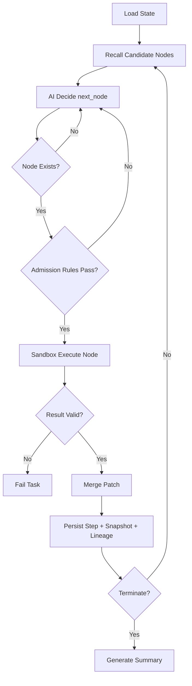
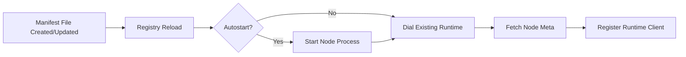
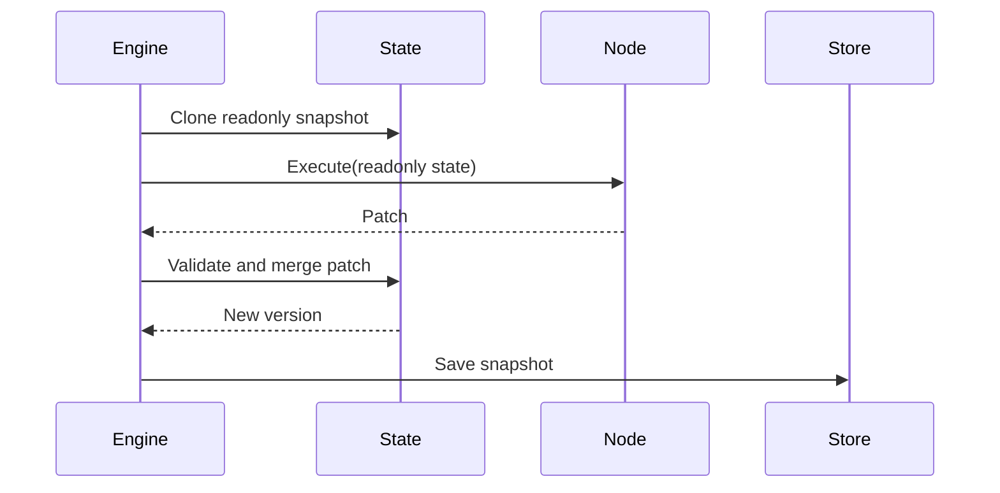

# DynAgent Design Specification 🧠⚙️

## 1. Design Goals 🎯

DynAgent is designed for a narrow but demanding target:

- execution-time graph construction
- production-safe node isolation
- deterministic runtime control around non-deterministic AI routing
- clear ownership boundaries between scheduler, node logic, and persistence

This document focuses on design decisions, tradeoffs, and internal runtime mechanics.

## 2. Non-Goals ⛔

DynAgent intentionally does not try to be:

- a visual workflow editor
- a BPMN/DAG orchestrator
- a business-specific copilot framework
- a generic plugin marketplace runtime with arbitrary in-process code loading

## 3. Design Principles 🧭

### Runtime over DSL 📐

The framework exposes runtime contracts instead of inventing a new orchestration DSL.

### AI chooses, runtime verifies 🤖

The model can choose any node. The runtime decides whether that choice is admissible and executable.

### Immutable node inputs 🧬

Nodes receive a deep-copied readonly view of state.

### Patches, not mutation 🩹

Nodes emit `Patch`; only the engine merges it.

### Hot-load operationally, not magically 🔥

External nodes are separate processes, registered through manifests and called over gRPC.

## 4. Component Design 🧱

### 4.1 AI Gateway

Responsibilities:

- provider abstraction
- normalized decision payloads
- retries
- rate limiting
- circuit breaker
- fallback model routing

Decision contract:

```json
{
  "next_node": "string",
  "reasoning": "string",
  "data": {}
}
```

### 4.2 Node Plane

Two node classes exist:

- builtin nodes compiled into the binary
- external nodes running as separate processes

Reason for external runtime model:

- avoids Go plugin portability issues
- decouples node crashes from engine process
- supports manifest-driven hot-load behavior

### 4.3 Rule Chain

Admission rules are CEL expressions evaluated against the current state projection.

Design intent:

- configuration-driven policy
- runtime-traceable rejection reasons
- no side effects

### 4.4 State Bus

State is versioned and task-scoped.

```text
State
├── TaskMeta
├── UserInput
├── WorkingMemory
├── NodeOutputs
├── DecisionLog
├── Trace
├── Sensitive
└── Ext
```

### 4.5 Persistence

Persistence is split by access pattern:

- relational records for tasks, steps, summaries, lineage
- cache / short-term memory in Redis
- cold storage abstraction for future object storage support

## 5. Core Runtime Flows 🔁

### Task Execution 🚀



### External Node Hot-Load 🔌



### Snapshot Lifecycle 📸



## 6. Failure Strategy ☄️

### Node Failure Modes

- panic
- timeout
- invalid patch
- admission rejection

Mitigations:

- recover in sandbox
- context timeout
- patch validation before merge
- explicit rejection reason logging

### AI Failure Modes

- model request timeout
- provider outage
- malformed decision

Mitigations:

- retry
- fallback model
- output normalization
- circuit breaker

### Task Failure Modes

- infinite loop
- excessive steps
- total timeout

Mitigations:

- visited-node counters
- max-step limit
- task deadline

## 7. Why This Shape 🧠

DynAgent is intentionally opinionated:

- dynamic graph, but strong runtime control
- pluggable nodes, but strict state ownership
- model-driven routing, but auditable execution

That combination is what makes it suitable as an open source runtime kernel instead of a one-off agent demo.
