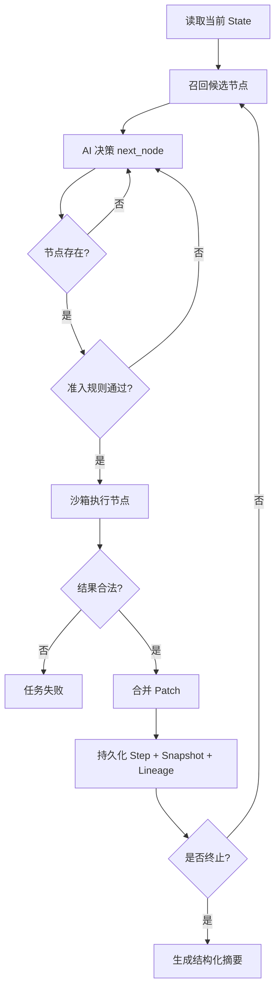
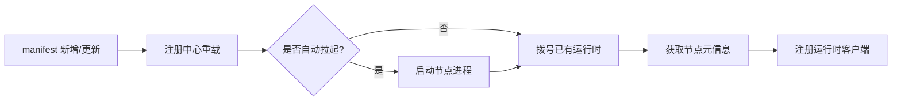
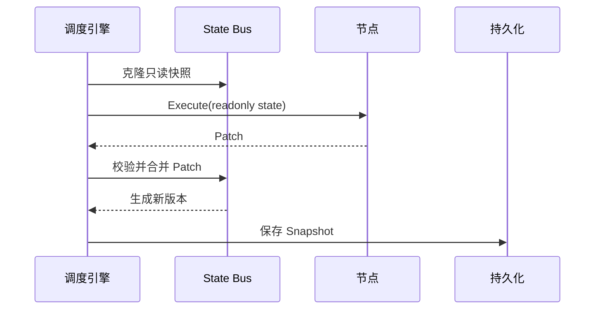

# DynAgent 设计方案 🧠⚙️

## 1. 设计目标 🎯

DynAgent 面向的是一类很窄但很硬的需求：

- 执行图在运行时动态生成
- 节点执行必须生产级隔离
- AI 路由有不确定性，但运行时控制必须确定
- 调度器、节点逻辑、持久化边界要清晰

这份文档关注的是设计决策、权衡和运行时机制，不只是模块介绍。

## 2. 非目标 ⛔

DynAgent 明确不打算做这些事情：

- 可视化工作流拖拽器
- BPMN / 固定 DAG 编排器
- 绑定某个垂直业务的 Copilot 框架
- 任意代码直接注入主进程的插件市场运行时

## 3. 设计原则 🧭

### Runtime over DSL 📐

框架暴露的是运行时契约，而不是再发明一套编排 DSL。

### AI 负责选择，Runtime 负责校验 🤖

模型可以选择任意节点；但是否允许执行，由运行时来裁决。

### 节点输入不可变 🧬

节点拿到的是 State 的深拷贝只读视图。

### Patch 而不是直接修改 🩹

节点只能产出 `Patch`；只有引擎能合并它。

### 热加载要可运维，而不是“魔法” 🔥

外部节点是独立进程，通过 manifest 注册，通过 gRPC 调用。

## 4. 组件设计 🧱

### 4.1 AI Gateway

职责：

- 屏蔽模型厂商差异
- 统一决策输出
- 重试
- 限流
- 熔断
- 主备模型切换

决策契约：

```json
{
  "next_node": "string",
  "reasoning": "string",
  "data": {}
}
```

### 4.2 Node Plane

节点分两类：

- 编译进主程序的内置节点
- 以独立进程运行的外部节点

为什么选择外部运行时模型：

- 避开 Go plugin 的兼容性问题
- 节点崩溃不会拖死调度进程
- 能更自然地支持 manifest 驱动的热加载

### 4.3 Rule Chain

准入规则使用 CEL 表达式，并且只针对当前状态投影求值。

设计意图：

- 配置驱动
- 拒绝原因可追踪
- 纯函数、无副作用

### 4.4 State Bus

State 是任务级隔离、带版本号的。

```text
State
├── TaskMeta
├── UserInput
├── WorkingMemory
├── NodeOutputs
├── DecisionLog
├── Trace
├── Sensitive
└── Ext
```

### 4.5 Persistence

持久化按访问模式拆分：

- 关系型记录：task、step、summary、lineage
- Redis：短期记忆、缓存和运行态
- 冷数据抽象：为后续对象存储预留

## 5. 核心运行时流程 🔁

### 任务执行流程 🚀



### 外部节点热加载流程 🔌



### Snapshot 生命周期 📸



## 6. 故障处理策略 ☄️

### 节点故障

- panic
- 超时
- 非法 patch
- 准入拒绝

对应措施：

- sandbox recover
- context timeout
- 合并前 patch 校验
- 显式记录拒绝原因

### AI 故障

- 模型超时
- 厂商不可用
- 输出格式异常

对应措施：

- 重试
- 备用模型
- 输出归一化
- 熔断

### 任务故障

- 死循环
- 执行步数过多
- 总耗时超时

对应措施：

- 节点访问计数
- 最大步数限制
- 任务 deadline

## 7. 为什么设计成这样 🧠

DynAgent 是刻意“有立场”的：

- 图是动态的，但运行时控制必须强
- 节点是可插拔的，但状态所有权必须严格
- 路由由模型驱动，但执行必须可审计、可回放

这也是它适合作为开源运行时内核，而不是一次性 Agent Demo 的根本原因。
